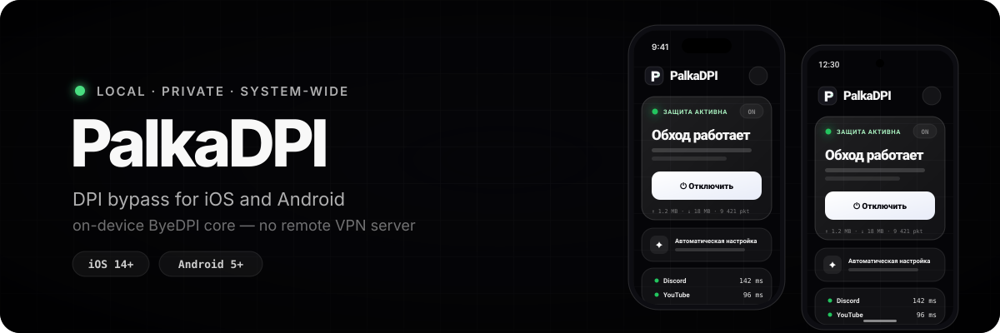

<p align="center">
  
</p>

<p align="center">
  <a href="https://github.com/zondaxxx/PalkaDPI/actions/workflows/build-release.yml"></a>
  <a href="https://github.com/zondaxxx/PalkaDPI/releases/latest"></a>
  <a href="./LICENSE"></a>
  
</p>

# PalkaDPI

Простое iOS-приложение для локального обхода DPI. Оно поднимает системный
`NEPacketTunnelProvider`, направляет трафик через локальный SOCKS-туннель и
обрабатывает его ядром ByeDPI прямо на iPhone. Внешний VPN-сервер не используется.

> PalkaDPI не скрывает IP-адрес, не меняет страну и не добавляет VPN-шифрование.
> VPN-профиль iOS нужен только для системной маршрутизации трафика в локальное ядро.

## Возможности

- одно понятное действие «Подключить» на главном экране;
- автоматический подбор рабочей стратегии для текущей Wi-Fi или сотовой сети;
- Discord, YouTube, Instagram, TikTok, X/Twitter, Telegram и свои домены;
- подробная диагностика DNS, TLS и HTTP с несколькими замерами вместо одного «пинга»;
- безопасное восстановление: повторный тест, откат и предложение запасной стратегии;
- On Demand-подключение и отдельные профили стратегий для Wi-Fi и сотовой сети;
- подписанный Ed25519 онлайн-каталог с поиском, избранным, историей и офлайн-откатом;
- виджет состояния и команды Siri/Shortcuts для запуска, остановки и проверки сервисов;
- приватный JSON-отчёт для поддержки без IP-адресов и содержимого трафика;
- локальная работа без аккаунтов, аналитики и удалённого VPN-сервера;
- отдельный экспертный раздел для DNS, прокси, доменных списков и диагностики;
- русский и английский интерфейс;
- автоматическая сборка проверенного unsigned IPA через GitHub Actions.

## Быстрый старт

1. Скачайте [последний unsigned IPA](https://github.com/zondaxxx/PalkaDPI/releases/latest/download/PalkaDPI-unsigned.ipa).
2. Подпишите `PalkaWidget.appex`, затем `ByeByeDPITun.appex`, затем основное приложение.
3. Установите IPA на физический iPhone.
4. Выберите нужные сервисы и нажмите «Автонастройка» — приложение само проверит стратегии.
5. Разрешите добавление VPN-конфигурации и сохраните найденный вариант для текущей сети.

Нужны три App ID/provisioning profile: приложение, `.widget` и `.tun`. Все три
должны иметь один App Group; entitlement `packet-tunnel-provider` нужен только
туннелю. Одного сертификата разработчика недостаточно.

Подробная инструкция: [PALKA-README.md](./PALKA-README.md).

## Онлайн-стратегии

Приложение загружает [strategy-catalog.json](./strategy-catalog.json) и его
[отделённую подпись](./strategy-catalog.json.sig) напрямую из этого репозитория
по HTTPS. Каталог можно безопасно обновлять без перевыпуска IPA.

Перед применением PalkaDPI проверяет Ed25519-подпись, схему, совместимость с
версией приложения и ядра, отозванные записи, HTTPS-источники и аргументы ByeDPI.
Три последних проверенных поколения доступны офлайн; из настроек можно выполнить
откат на предыдущее поколение.

Как добавить профиль: [docs/STRATEGY-CATALOG.md](./docs/STRATEGY-CATALOG.md).

## Диагностика сервисов

Главный экран делает несколько небольших HTTPS-запросов к официальным адресам
выбранных сервисов. Это не ICMP-ping: приложение показывает медианный HTTP round
trip, а подробный экран отдельно отображает DNS, TLS и HTTP. При активном туннеле
запросы проходят через текущую конфигурацию PalkaDPI.

## Сборка

```bash
git clone https://github.com/zondaxxx/PalkaDPI.git
cd PalkaDPI
open SwByeDPI.xcodeproj
```

Выберите схему `ByeByeDPI`, укажите Team, Bundle ID и App Group для приложения,
виджета и Packet Tunnel extension. Для unsigned IPA с полным Xcode:

```bash
PALKA_BUNDLE_ID=your.unique.palkadpi \
PALKA_APP_GROUP=group.your.unique.palkadpi \
./scripts/build_unsigned_ipa.sh
```

Результат: `packages/PalkaDPI-unsigned.ipa`.

## Структура

```text
Example/Sources/ByeByeDPI/       iOS-приложение и SwiftUI
Example/Sources/ByeByeDPITun/    Packet Tunnel extension
Example/Sources/PalkaWidget/     WidgetKit extension
Sources/ByeDPIC/                 встроенное C-ядро byedpi
Sources/ByeDPIKit/               Swift-обёртка над ядром
Sources/SwByeDPI/                модели, списки и диагностика
strategy-catalog.json            обновляемый онлайн-каталог
strategy-catalog.json.sig        подпись каталога Ed25519
scripts/                         сборка и валидация
```

## Происхождение проекта

PalkaDPI — производная работа от [mIwr/SwByeDPI](https://github.com/mIwr/SwByeDPI)
с ядром [hufrea/byedpi](https://github.com/hufrea/byedpi). Идея простого профиля
для Discord и YouTube вдохновлена [Flowseal/zapret-discord-youtube](https://github.com/Flowseal/zapret-discord-youtube),
но Windows-компоненты zapret и WinDivert в приложение не входят.

Полный перечень встроенного кода, зависимостей, источников доменных списков,
транзитивных проектов и лицензий находится в
[ACKNOWLEDGEMENTS.md](./ACKNOWLEDGEMENTS.md).

Политика обработки данных: [docs/PRIVACY.md](./docs/PRIVACY.md).

## Ограничения

- эффективность стратегии зависит от сети, оператора и текущего способа фильтрации;
- iOS не предоставляет WinDivert/NFQUEUE и произвольную raw TCP-инъекцию;
- QUIC/UDP 443 нельзя фильтровать по SNI тем же способом, что TCP/TLS;
- тестировать туннель нужно на физическом устройстве;
- используйте приложение только в соответствии с применимым законодательством.

## Лицензия

Проект распространяется по [AGPL-3.0](./LICENSE). Встроенное ядро byedpi сохраняет
свою MIT-лицензию в [Sources/ByeDPIC/byedpi/LICENSE](./Sources/ByeDPIC/byedpi/LICENSE).
